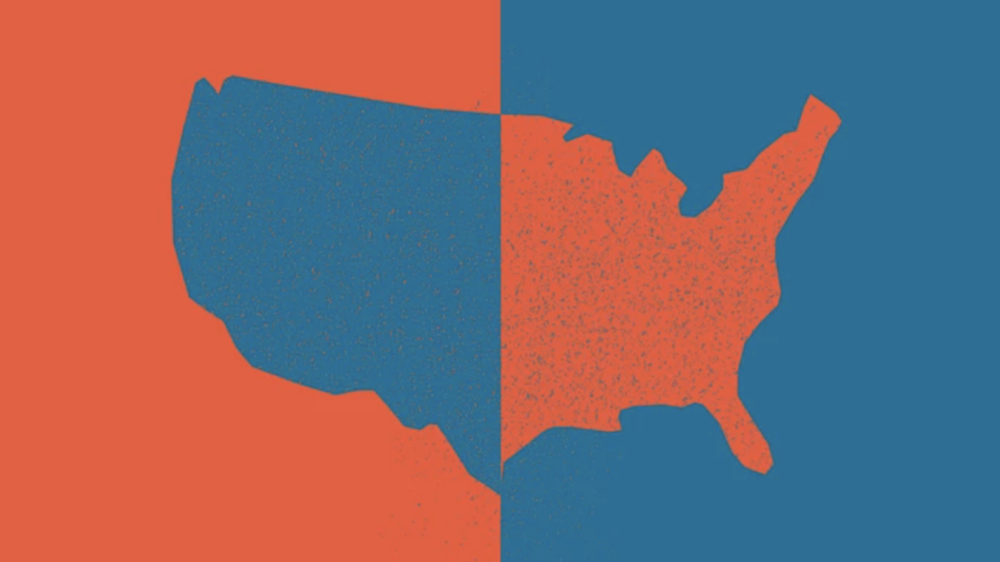

# Applied Data Science @ Columbia
## Fall 2020
## Project 1: A "data story" on how Americans vote



### [Project Description](doc/)
This is the first and only *individual* (as opposed to *team*) this semester. 

Term: Fall 2020

+ Project title: Who Didn't Vote in 2016
+ This project is conducted by Kristen Akey

+ Project summary: 
  + Elections are one of the main ways Americans can express their political opinions and actively take part in the democratic process. The most recent presidential election in 2016 and the midterms in 2018 showcased the importance of turning out to vote. When individuals vote, they have their voices heard and have a chance to express themselves politically. While we often hear about the people and preferences of those who voted, what about the political opinions of people who don’t and didn’t vote in 2016? Who were the people that didn’t vote in 2016? 
  + This data story seeks to explore the characteristics and preferences of the American population who did not turn out to vote in 2016. I start by analyzing voter turnout rates in 2016 and past elections to understand if the size of the population that did not vote in 2016 was relatively similar to past elections. Next, I examine the demographics of those who did not vote. I compare non-voters to those who had voted in the 2016 election to see if certain characteristics are most associated with voting or not voting. Lastly, I analyze the political preferences of those that had not voted to consider the theoretical question of how would the election outcome have changed, if at all, had those who had not voted, actually voted.


Following [suggestions](http://nicercode.github.io/blog/2013-04-05-projects/) by [RICH FITZJOHN](http://nicercode.github.io/about/#Team) (@richfitz). This folder is orgarnized as follows.

```
proj/
├── dev/
├── data/
├── doc/
├── figs/
└── output/
```

Please see each subfolder for a README file.
